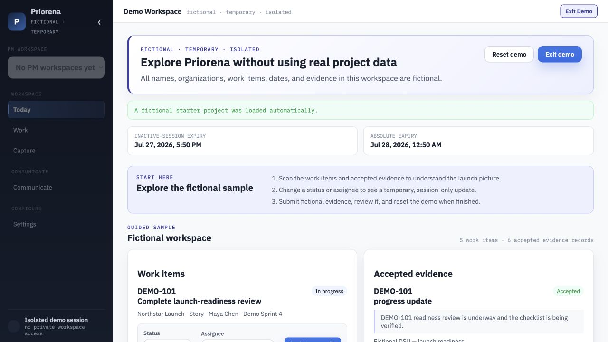
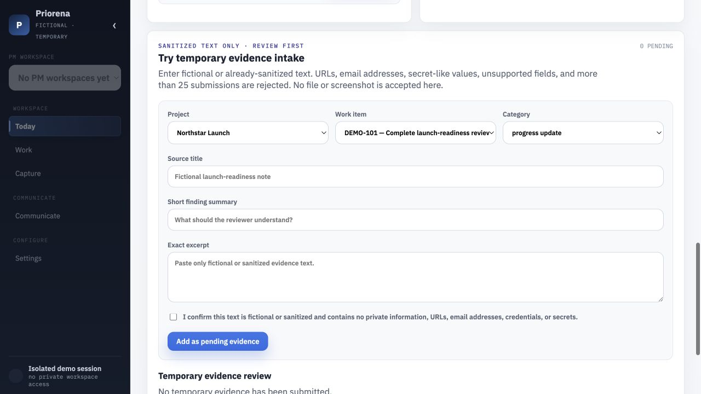
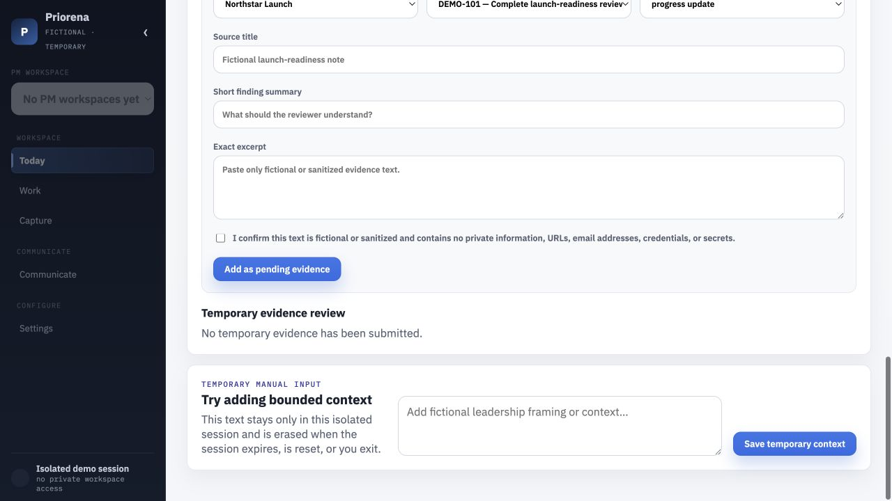

# Priorena

Priorena is a local delivery-intelligence workspace for project managers. It helps a PM review evidence, understand what changed, decide what needs attention, and prepare consistent updates for Teams, leadership email, and Confluence—without replacing Jira or publishing anything automatically.

Repository: https://github.com/andreygrubinnyc/priorena

This repository is a sanitized public edition. It contains only application source, independently fictional demo data, synthetic tests, and self-hosted fonts. It does not contain operational workspace data, uploads, screenshots, credentials, private identifiers, or a connection to a live Jira instance.

## Why it exists

Delivery work rarely slows down because information is completely unavailable. It slows down because decisions are scattered across standups, Jira comments, planning notes, and follow-up conversations. Priorena turns that material into a review-first evidence queue and then into audience-specific briefings with explicit communication baselines.

The core workflow is:

1. Capture bounded text evidence from DSU, Sprint Planning, Backlog Refinement, or an externally generated structured feed.
2. Review every extracted finding before it becomes trusted evidence.
3. Associate work items with a Project only through an exact reviewed Jira Epic key or name.
4. Prepare a briefing from accepted evidence, detected changes, and clearly labeled Manual PM input.
5. Finalize one fact set and render consistent Teams, email, and Confluence-ready outputs.
6. Advance a stream’s comparison baseline only when the PM explicitly marks the briefing communicated.

## Product boundary

Priorena is intentionally a single-user local application:

- The server binds only to `127.0.0.1`.
- It is not approved for LAN access, tunnels, reverse proxies, hosted deployment, or multiple users.
- There is no authentication because loopback-only operation is the supported boundary; loopback is not a substitute for authentication in any broader deployment.
- Jira and approved source material remain authoritative for work-item facts.
- AI drafting is optional. Deterministic extraction and output fallbacks work without an API key.
- Original screenshots never enter Priorena. The app accepts only a strict, bounded `.json` or `.md` feed generated elsewhere.
- Nothing is sent, published, or marked communicated automatically.

## Try the fictional demo

Requirements:

- Node.js 24
- npm

```bash
npm install
cp .env.example .env
npm start
```

Open [http://127.0.0.1:3000](http://127.0.0.1:3000). Demo Mode automatically opens a fictional **Northstar Launch** starter project with five work items, six accepted evidence records, three milestones, and a short guided walkthrough. You can temporarily update work items, add and review sanitized evidence, and reset the sample.

The demo is independently fictional and temporary. Each local browser session receives an isolated in-memory workspace. Demo state is erased on reset, exit, expiry, or server restart and never enters the normal persistence path.

To run without Demo Mode, remove `PRIORENA_DEMO_MODE=1` from `.env`.

## Screenshots







## Run the private local workspace

Without environment overrides, local state is created under the git-ignored `.priorena-data/` directory:

```text
.priorena-data/
├── pilot-data.json
└── uploads/
    └── transcripts/
```

Advanced users can retain the legacy compatibility variables `PMDS_DATA_FILE` and `PMDS_UPLOADS_DIR` to choose different private local paths. Never commit those files or use real workspace material in tests, issues, screenshots, or public examples.

## Optional AI drafting

AI is not required. If you explicitly enable a provider, copy `.env.example` to `.env` and set either `OPENAI_API_KEY` or `CLAUDE_API_KEY`. Relevant selected project text is then sent to that configured provider only for the requested drafting action.

Keep `.env` private. Use only an organization-approved provider and do not submit material you are not authorized to process.

## Technology

- Node.js and Express
- Vanilla JavaScript frontend
- Busboy for bounded multipart parsing
- Whole-file local JSON persistence with atomic replacement
- Self-hosted IBM Plex Sans and IBM Plex Mono
- Optional OpenAI or Anthropic drafting through fixed provider endpoints
- Deterministic local extraction and communication-output fallbacks

## Verification

```bash
npm test
```

The suite covers loopback request boundaries, security headers, bounded uploads and imports, rejected-file cleanup, review queues, external-feed v1/v2/v3 compatibility, exact Jira-Epic association, typed work items, briefing lifecycle and baselines, output traceability, fictional demo isolation and expiry, export neutralization, AI throttling, and safe failure behavior.

The source snapshot used to prepare this public edition completed a repository-wide Codex Security review with no reportable findings. See [SECURITY_REVIEW_SUMMARY.md](SECURITY_REVIEW_SUMMARY.md) for the bounded verification record. That result applies only to the reviewed snapshot and the documented local-only deployment boundary; it is not a guarantee of future security.

## Repository map

```text
briefings/        Briefing validation, lifecycle, and evidence candidates
demo/             Independently fictional fixture and in-memory session store
public/           Browser application, styles, utilities, and self-hosted fonts
test/             Synthetic security and domain regression tests
workspaces/       Project/Jira-Epic domain rules
external-feed.js  Strict external-feed parser and reconciliation logic
server.js         Loopback-only Express application and API routes
```

## Security and privacy

Read [SECURITY.md](SECURITY.md) and [PRIVACY.md](PRIVACY.md) before changing deployment, persistence, uploads, provider behavior, or the user model.

Do not open security issues containing real workspace data, credentials, private transcripts, or screenshots. Report suspected vulnerabilities privately to the repository owner.

## Current limitations

- Single-user and local-only
- No live Jira, Teams, email, or Confluence connector
- No authentication or multi-tenant authorization
- Whole-file JSON storage is not appropriate for concurrent or hosted use
- Public hosting requires a new architecture, threat model, transactional storage, abuse controls, monitoring, and incident response
